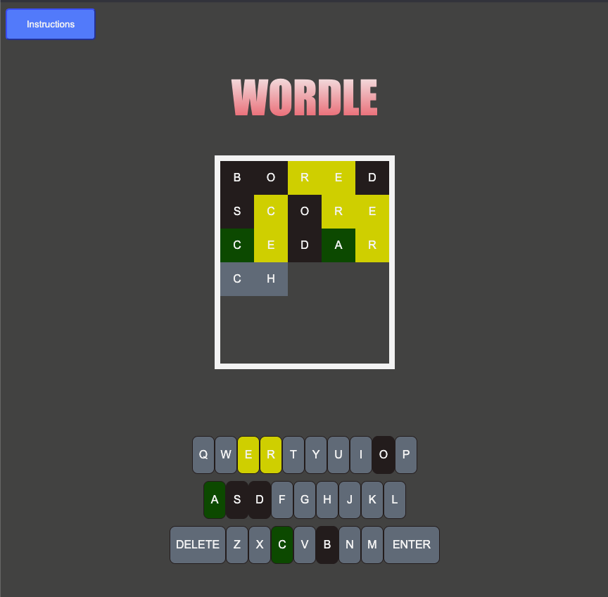

# Wordle game

## Wireframes

## My Game image

## Technologies used
HTML, CSS and JavaScript

## Getting Started
### Game URL
https://mu-tsu-mi.github.io/wordle/

### User Story
As a player, 
* I press the play button to start the game. Maximum number of play per game is set as 3 times.
* I am given 6 attempts to guess the correct word that consists from 5 letters.
* When I guess a correct character in the right place, the word box turns green, 
When I guess it correctly but in an incorrect spot, the word box turns yellow. 
The box turns grey when I guess a character incorrectly. 
* Keys colour on the keyboard also change.
In this way,  I will know which one I need to continue guessing to reveal the answer.

* Score board will be updated and I can collect the words I answered correctly in my word-bank and an animal sticker per win.

## Roadmap
> Basic feature - Make the game work
 >> Instructions screen, Main screen, Generating computer choice of word, Limiting # of letters as five letters, Updating player's letter choice to word-boxes, Checking if the letters are matched with computer choice, and updating keys and letters in the word-boxes colour, Making Enter-button work, Making Delete-button work, Clearing key & word boxes colour for the next play, Play-count, Win-count, Resetting the game, Win screen, Lose screen with a message of the correct wordle word, Updating Word-bank in Win-screen, Updating scoreboard, Removing play status from the scoreboard, Making sure each screen appear/ hide correctly

> Enhancement I added - Make the game fun & smooth
 >> Updating and limiting play-count maximum 3 times per game, Adding animal sticker table

## Future Enhancement Feature to Consider
Add real-word-verification feature

## Presentation notes on my progress of the project
I made wordle. I set maximum number of play to 3 times per game. I used this website (https://www.rockpapershotgun.com/wordle-past-answers) for my wordle words that has the real wordle answers.
I added animal stickers as a reward when a player wins the game. I followed the same rule as the real wordle for the # of attempts to guess the word (6 times) and colouring keyboard keys and the letters in player’s word selection.
When a player loses, a message will tell the player about the correct word and it also shows the scoreboard. When it is a win, the player gets the word and an animal sticker in their word-bank . The scoreboard is also updated to show its win. 

< html&css >
I started working on minimum items of html and css to start working on JS.
In html, at first, I made spans for player’s word boxes too. But I changed it when I worked on updating player’s word in JS. My plan at the beginning was to try grid box in css. However, I used DOM to create div to update player’s word box. This made using grid box in css not a good option, so I used flexbox. Before this project, I thought I would need to use more than one web-page. I had no idea of using hiding and showing elements. That was kind of interesting discovery for me. 

< JavaScript >
The function that surprised me is the chunkiest one in my JS file, “wordCheck” function. This handles most of my game logic. I didn’t expect this to grow this chunky. However, as I see many bugs, I had to fatten this function with lots of codes/logic. 
Thanks to Gab’s advice, I could use “dataset letter” to update word-box to reflect player’s choice of letters early on. 
Adding letters in word boxes, then checking those letters and the letters of computer choice was my biggest challenge. 
I found it difficult using DOM. I also learnt that using too much DOM (adding elements in JS, instead of preparing these in html) sometimes does not help, making JS file messier as I needed to remove the elements that I created at some point. So, I didn’t add elements in JS for updating lost-message and animal stickers. I used innerHTML updating it as blank (for animal stickers) and to show the lost message.
 
For no reason, I preferred to use “class” over “id” at the beginning. I probably thought it would be more flexible in many situations. However, as I went on I thought using “id” does not complicate situation as most of the time I needed to target one specific element in html to update, such as  play-count, win-Words and animal stickers. 
I still get confused looking at my code in Javascript, I think I need to be better at naming variables and functions in addition to making code look more readable.

### TODO
* Add basic HTML
* Add basic CSS
* Game logic JavaScript for happy scenario
* Modify JavaScript for edge cases
* Game logic JavaScript for other scenarios
* Add CSS
* Fix bugs JavaScript
